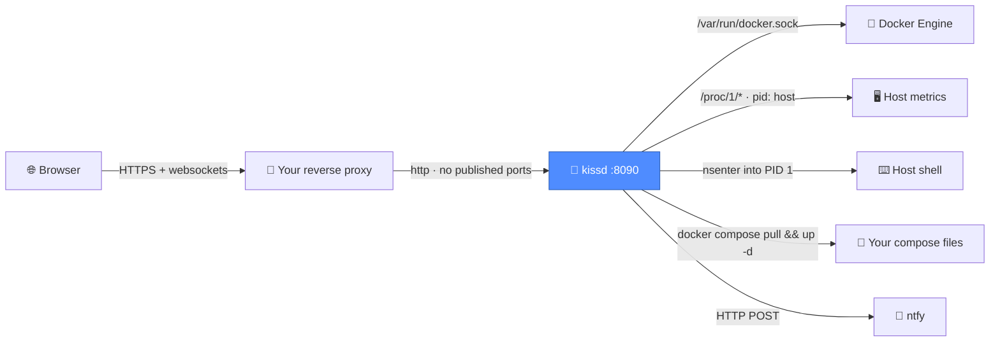

<div align="center">

# 💋 kissd

**Keep It Super Simple Dashboard**

Your whole Docker host in a browser — containers, metrics, alerts, pruning and
terminals — from **one container that installs nothing on your machine**.

[](LICENSE)
[](https://github.com/cyrilknops/kissd/stargazers)


</div>

---

## 💋 The name

**K**eep **I**t **S**uper **S**imple **D**ashboard. Pronounced *kissed*.

Which is also the design brief. It is a peck on the cheek, not a French kiss —
kissd keeps its tongue well clear of your nginx config. It touches your host
lightly, leaves nothing behind, and does not move in and rearrange the
furniture.

## 🤔 Why

Most self-hosted server panels want to *own* the machine. They install their own
nginx, take ports 80 and 443, manage your certificates, and run a package
manager behind your back. If you already have a reverse proxy — Nginx Proxy
Manager, Traefik, Caddy — that is a fight you did not ask for.

Worse, several of them only show you the containers *they* created. Point one at
an existing host with twenty running services and you get a shrug and an empty
list.

kissd does the opposite. It shows **what is already there**, changes nothing
about how your host is arranged, and gets out of the way.

## 📊 By the numbers

| | |
|---|---|
| 🧠 **Memory at rest** | **31 MB** |
| ⚡ **Cold start** | **1.4 s** |
| 🏃 **22 containers listed in** | **0.16 s** |
| 📦 **Image** | **469 MB** |
| 📜 **Source** | **3,678 lines** (1,585 server · 2,093 web) |
| 🔌 **Runtime dependencies** | **8** server · **5** web |
| 🗄️ **Database** | **none** — settings are one JSON file |
| 🩹 **Packages installed on your host** | **zero** |

## ✨ What you get

| | |
|---|---|
| 📦 **Containers** | Every container on the host, as cards grouped by compose project, with live CPU, memory, health, ports and uptime |
| 🔍 **Detail page** | Per-container stats, mounts, networks, published ports, restart policy, failing healthcheck output, and live logs |
| 🎛️ **Actions** | Start, stop, restart, and update via `docker compose pull && up -d`, resolved from each container's own compose labels — one service, or a whole project at once from its group header |
| 📈 **Host metrics** | CPU, load, memory, swap, network throughput, per-mount disk usage |
| 🔔 **Alerts** | ntfy push when a container stops, goes unhealthy, or enters a restart loop — plus disk, memory and load thresholds |
| 🔑 **Registries** | Private registry logins in Settings, applied to every `docker` the panel runs — no `docker login` on the host |
| 📝 **Compose** | View and edit the compose file behind any project, with validation, automatic backups and one-click apply |
| 🧹 **Maintenance** | Disk usage breakdown and per-target pruning, with named volumes handled one at a time |
| 💻 **Terminals** | A shell in any container, a root shell on the host, and Claude Code — all in the browser |
| 📱 **Phone-ready** | The same panel on a phone: the sidebar becomes a drawer, dialogs become sheets, and it installs to the home screen as a PWA |

Everything is one screen deep. No wizard, no onboarding, no marketplace, no
telemetry.

### 📱 On a phone

kissd ships a web app manifest and a service worker, so **Add to home screen**
(or Chrome's install prompt, which the sidebar surfaces as an **Install app**
button) gives you a standalone app with no browser chrome. Opening it offline
shows the panel rather than a browser error page — it just has no data until
the server is reachable again.

The service worker caches only the app shell and its hashed assets. Nothing
under `/api/` is ever cached, so you are never looking at a stale container
list, and no authenticated response is written to disk.

## 🏗️ How it works



kissd publishes **no host ports**. Your proxy reaches it over a shared Docker
network, so there is nothing on the host for it to collide with.

## 🚀 Install

You need Docker with the compose plugin, and a reverse proxy in front — kissd
publishes no host ports and its session cookies are `Secure`, so it expects
HTTPS.

```bash
git clone https://github.com/cyrilknops/kissd.git
cd kissd
cp .env.example .env
```

Set a password and a session secret in `.env`:

```bash
openssl rand -hex 32    # use this for KISSD_JWT_SECRET
```

Then bring it up:

```bash
docker compose up -d --build
```

Point your proxy at `kissd:8090`. **Websocket upgrades must be enabled** — the
terminals and log streaming will not work without them.

> 💡 Claude Code is **not** in the image — it is ~270 MB and would be pulled on
> every update. Install it with a button from the Terminal page instead; it
> lands in the `data/` volume and survives rebuilds. If your host has no
> outbound npm access at runtime, bake it in with
> `--build-arg WITH_CLAUDE=1`.

<details>
<summary>📋 Nginx Proxy Manager settings</summary>

<br>

| Field | Value |
|---|---|
| Scheme | `http` |
| Forward hostname | `kissd` |
| Forward port | `8090` |
| Websockets Support | **on** ← required |
| Force SSL | on |

kissd joins an external network named `proxy-tier` by default. Change that in
`docker-compose.yml` to whatever network your proxy is on.

</details>

## ⚙️ Configuration

`.env` holds only what is needed to boot:

| Variable | Purpose |
|---|---|
| `KISSD_ADMIN_USER` / `KISSD_ADMIN_PASSWORD` | Login. Hashed at boot; never written to disk. |
| `KISSD_JWT_SECRET` | Signs session cookies. Changing it logs everyone out. |
| `REPO_DIR` | Where your compose files live. Bind-mounted at the *same* path inside the container so `docker compose` resolves relative binds correctly. |
| `NTFY_URL` / `NTFY_TOPIC` / `NTFY_TOKEN` | Optional first-run seed for notifications. |

Everything else — ntfy server, auth mode, registry logins, alert toggles,
thresholds, cooldown, hysteresis — lives in **Settings** and is stored in
`data/settings.json` (mode 0600). Changes apply immediately, with no restart.

🔐 ntfy and registry credentials never travel back to the browser. The UI shows
*set / not set* plus a four-character hint, and only overwrites a secret when
you type a new one.

### 🔑 Private registries

Docker keeps registry logins **per client**, not in the daemon: `docker login`
writes them to the calling user's config, and the CLI attaches them to each
pull. So a login done over SSH is invisible to kissd, and a private image that
pulls fine from a host shell fails in the panel with:

```
pull access denied, repository does not exist or may require authorization:
authorization failed: no basic auth credentials
```

Add the registry under **Settings › Container registries** instead. Credentials
are written to `data/docker/config.json` (mode 0600), which every `docker` the
panel runs points at via `DOCKER_CONFIG` — so one login covers container
updates, project updates and compose apply alike, including the detached
self-update that runs in the host's namespaces. **Test logins** verifies each
one against the real registry before you rely on it, and removing a registry
removes its credential rather than orphaning it.

## 🔔 Alerts

Threshold alerts use **hysteresis and a cooldown**, so a disk hovering at 85%
sends one notification rather than one every 30 seconds, and only announces
recovery once it has clearly dropped back.

Container alerts fire on **state transitions**, so a container you stopped on
purpose does not nag you. The first poll after a restart takes a silent
baseline.

Restart loops are counted over a **rolling window** (default: 3 restarts within
60 minutes). Comparing only against the previous poll would miss a slow loop — a
container restarting every few minutes never shows a spike between two
30-second samples, yet it is still looping.

## 🧹 Pruning

The Maintenance page prunes dangling images, unused images, stopped containers,
build cache and unused networks — each behind its own confirmation showing what
will be freed.

> ⚠️ **There is deliberately no bulk volume prune.** Docker treats a named
> volume as "dangling" whenever its container merely isn't running, so
> `docker volume prune` happily destroys live data. On the host this was built
> for, it would have taken out a 210 MB MongoDB volume whose container simply
> wasn't running that day.

kissd instead lists unused volumes by name, size and compose project, and
deletes them one at a time — each requiring your password *and* the volume name
typed out. The refcount is re-checked at the moment of deletion, so a volume
that got attached in the meantime is refused.

Reported figures are what a prune would **actually free**, which is not always
what `docker system df` prints in its RECLAIMABLE column — that number counts
total-minus-unused and can claim 75% reclaimable while most images are in
active use.

## 📝 Editing compose files

The Compose page lists every project on the host and lets you edit the compose
file behind it. Saving is deliberately careful:

- Only files Docker itself reports as a project's compose file can be opened —
  the allowlist is rebuilt from container labels on every request, so no path
  outside it is reachable, `.env` files included.
- The previous version is backed up into the kissd data volume, not your repo.
- After writing, `docker compose config` validates the result. If it does not
  parse, the file is **rolled back automatically** and the error is shown.
- Saving checks the file's mtime, so an edit made elsewhere since you opened it
  is refused rather than silently overwritten.

**Save** writes to disk without touching anything running. **Save & apply**
follows it with `docker compose up -d` and streams the output.

## 🔒 Security

kissd holds the Docker socket and can open a root shell on the host. **It is
root-equivalent access to your server.** That is the point of the tool, but be
deliberate about it:

- 🔑 Put it behind HTTPS and treat the login as a root password.
- 🚧 Consider an IP allowlist or basic auth at the proxy, *in front of* kissd.
- ⏱️ The host shell is gated behind re-entering your password, which mints a
  separate token valid for five minutes. That slows an attacker down; it does
  not stop one who has your password.
- 🐢 Login is rate-limited to five attempts per fifteen minutes.

The container runs `privileged` with `pid: host`. Both are required: `pid: host`
so host metrics come from the host's namespaces (`/proc/1/net/dev`,
`/proc/1/mounts`) rather than the container's, and `privileged` so `nsenter` can
reach PID 1 for the host shell. **If you do not want a host shell, drop both** —
everything except that one feature keeps working.

## 🤖 Claude Code

The **Claude** terminal tab runs [Claude Code](https://claude.com/claude-code)
right in the browser. Ask it why a container keeps restarting and it can read
the logs itself.

It is **not bundled** in the image. Hit **Install Claude Code** on the Terminal
page and it is fetched on demand — about six seconds — into
`data/npm-global/`. Because that is the mounted volume and not the image
layer, it survives `docker compose up --build`, container recreation and image
pulls. The same button updates it later.

Your sign-in persists in `data/home/`, so you authenticate once.

## 🛠️ Built with

**Back:** Node 22 · Express · dockerode · node-pty · ws
**Front:** React 18 · Vite · xterm.js · react-router
**Storage:** a JSON file. That's it.

The whole thing is one multi-stage `Dockerfile`.

## 🤝 Contributing

Issues and pull requests welcome. The bar for a new feature is simple: **does it
survive the name?** If it needs a wizard, a plugin system, or a second database,
it probably belongs somewhere else.

```bash
# backend — needs the Docker socket and the two required env vars
cd server && npm install
KISSD_ADMIN_PASSWORD=dev KISSD_JWT_SECRET=dev DATA_DIR=./data node src/index.js

# frontend — Vite proxies /api and /ws to :8090
cd web && npm install && npm run dev
```

Host metrics and the host shell only work inside the container, since they read
`/proc/1/*` and `nsenter` into PID 1.

## 📄 Licence

[GPL-3.0](LICENSE)

<div align="center">
<br>
<sub>Built for a VPS that already had a reverse proxy and no patience for another one.</sub>
</div>
